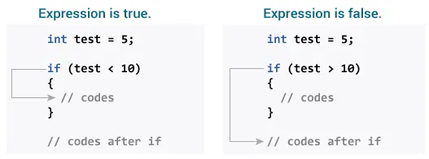
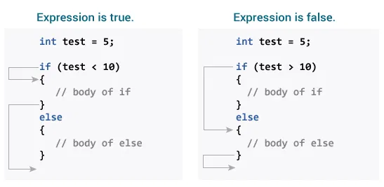
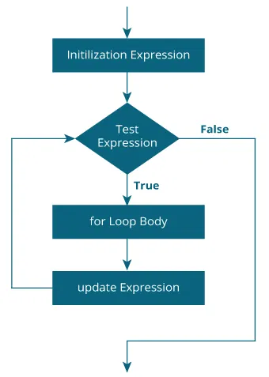
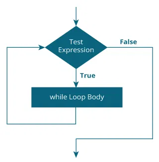
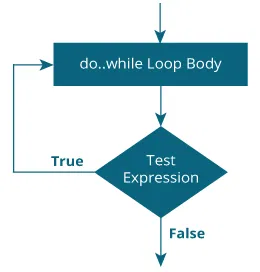
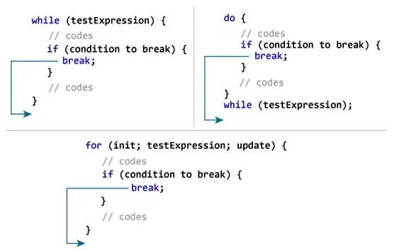

# Getting Started with C Programming 🧑🏻‍💻
- ***C is a powerful general-purpose programming language known for its efficiency and flexibility***.

# 🔁C Flow Control

## 1) `if...else` Statements in C

### ✅ Simple `if` Statement
📌 **Syntax:**
```c++
if (test expression) 
{
   // code
}
```
>[🔗 Example: `if` Statement](https://github.com/SonaniAkshit/Data-Structures-Algorithms-in-C/blob/main/Basic%20C/C%20Flow%20Control/C%20if...else%20Statement/if%20statement.c)

### 📌 How if statement works?
- The if statement evaluates the test expression inside the parenthesis ().
  - If the test expression is evaluated to true, statements inside the body of `if` are executed.
  - If the test expression is evaluated to false, statements inside the body of `if` are not executed.

### 📝 Working of if Statement



### ⚖️ `if...else` Statement
The `if` statement may have an optional `else` block.

📌 **Syntax:**
```c++
if (test expression) {
    // run code if test expression is true
}
else {
    // run code if test expression is false
}
```
>[🔗 Example: `if...else` Statement](https://github.com/SonaniAkshit/Data-Structures-Algorithms-in-C/blob/main/Basic%20C/C%20Flow%20Control/C%20if...else%20Statement/if%20else%20statement.c)

### 📌 How if...else statement works?
- If the test expression is evaluated to true,
  - statements inside the body of `if` are executed.
  - statements inside the body of `else` are skipped from execution.
- If the test expression is evaluated to false,
  - statements inside the body of `else` are executed
  - statements inside the body of if are skipped from execution.

### 📝 Working of if...else Statement


### 🪜 `if...else if` Ladder
The `if...else` statement executes two different codes depending upon whether the test expression is true or false. Sometimes, a choice has to be made from more than 2 possibilities.*

The **if...else ladder** allows you to check between multiple test expressions and execute different statements.*

📌 **Syntax:**
```c++
if (test expression1) {
   // statement(s)
}
else if(test expression2) {
   // statement(s)
}
else if (test expression3) {
   // statement(s)
}
.
.
else {
   // statement(s)
}
```
>[🔗 Example: `if...else if` Ladder](https://github.com/SonaniAkshit/Data-Structures-Algorithms-in-C/blob/main/Basic%20C/C%20Flow%20Control/C%20if...else%20Statement/if%20else%20Ladder.c)

### 🧩 Nested if...else
It is possible to include an `if...else` statement inside the body of another `if...else` statement.*

**Example:**

This program given below relates two integers using either `<`,` >` and `=` similar to the `if...else` ladder's example. However, we will use a nested `if...else` statement to solve this problem.
>[🔗 Example: Nested `if...else`](https://github.com/SonaniAkshit/Data-Structures-Algorithms-in-C/blob/main/Basic%20C/C%20Flow%20Control/C%20if...else%20Statement/Nested%20if%20else.c)

- **If the body of an `if...else` statement has only one statement, you do not need to use brackets `{}`.**

For example, this code
```c++
if (a > b) {
    printf("Hello");
}
printf("Hi");
```
- *is equivalent to*
```c++
if (a > b)
    printf("Hello");
printf("Hi");
```
---
## 2) Loops in C
In programming, a loop is used to repeat a block of code until the specified condition is met.

C programming has three types of loops:
1) `for` loop ✅
2) `while` loop ⏳
3) `do...while` loop 🔁

## 🧮 `for` Loop

📌 **Syntax**:
```c++
for (initializationStatement; testExpression; updateStatement)
{
    // statements inside the body of loop
}
```
### 📌 How for loop works?

The initialization runs once.

The test condition is checked:
- If true: execute the loop body.
- If false: exit the loop.

After each iteration, the update statement runs.

Repeat until the test condition becomes false.

### 📈 Flowchart of `for` loop:


>[🔗 Example1: `for` Loop](https://github.com/SonaniAkshit/Data-Structures-Algorithms-in-C/blob/main/Basic%20C/C%20Flow%20Control/C%20Loops/Ex1%20for%20loop.c)

>[🔗 Example2: `for` Loop](https://github.com/SonaniAkshit/Data-Structures-Algorithms-in-C/blob/main/Basic%20C/C%20Flow%20Control/C%20Loops/Ex2%20for%20loop.c)

## 🧮 `while`  Loop

📌 **Syntax**:
```c++
while (testExpression) {
  // the body of the loop 
}
```
### 📌 How while loop works?
The `while` loop evaluates the `testExpression` inside the parentheses `()`.

If `testExpression` is **true,** statements inside the body of `while` loop are executed. 
Then, `testExpression` is evaluated again.

The process goes on until `testExpression` is evaluated to **false.**

If `testExpression` is **false,** the loop terminates (ends).

### 📈 Flowchart of while loop

>[🔗 Example `while` loop](https://github.com/SonaniAkshit/Data-Structures-Algorithms-in-C/blob/main/Basic%20C/C%20Flow%20Control/C%20Loops/Ex%20while%20loop.c)

## 🧮 `do...while`  Loop
The `do..while` loop is similar to the `while` loop with one important difference. The body of `do...while` loop is executed at least once. Only then, the test expression is evaluated.

📌 **Syntax**:
```c++
do {
  // the body of the loop
}
while (testExpression);
```

### 📌 How do...while loop works?

The body of `do...while` loop is executed once. Only then, the `testExpression` is evaluated.

If `testExpression` is **true,** the body of the loop is executed again and `testExpression` is evaluated once more.

This process goes on until testExpression becomes **false.**

If `testExpression` is **false,** the loop ends.

### 📈 Flowchart of do...while loop

>[🔗 Example `do...while` loop](https://github.com/SonaniAkshit/Data-Structures-Algorithms-in-C/blob/main/Basic%20C/C%20Flow%20Control/C%20Loops/Ex%20do%20while%20loop.c)


# 3) Break and continue in C

## Break

**📌 Syntax:**
```c++
break;
```

The break statement is almost always used with `if...else` statement inside the loop.

### 📌 How break statement works?

>[🔗 Example `break;` statement](https://github.com/SonaniAkshit/Data-Structures-Algorithms-in-C/blob/main/Basic%20C/C%20Flow%20Control/C%20Loops/Ex%20break%20while%20loop.c)

This program calculates the sum of a maximum of 10 numbers. Why a maximum of 10 numbers? It's because if the user enters a negative number, the `break` statement is executed. This will end the `for` loop, and the `sum` is displayed.


---
### 🤝Clone & Setup
```bash
git clone https://github.com/SonaniAkshit/Data-Structures-Algorithms-in-C.git
cd Data-Structures-Algorithms-in-C
```

## 🙌 Contributing
- Pull requests and feedback are welcome! Whether it's fixing bugs, improving UI, or adding features — your help is appreciated.

## 📧 Contact
- **Developer:** Akshit Sonani
- **Email:** sonaniakshit684.com
- **GitHub:** [SonaniAkshit](https://github.com/SonaniAkshit)

# 🔥 Happy Coding! 🚀
### ⭐ Star this repository if you find it helpful!
