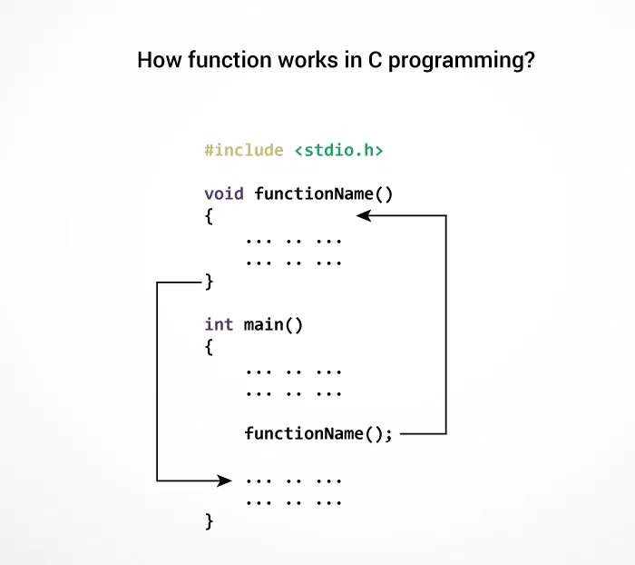
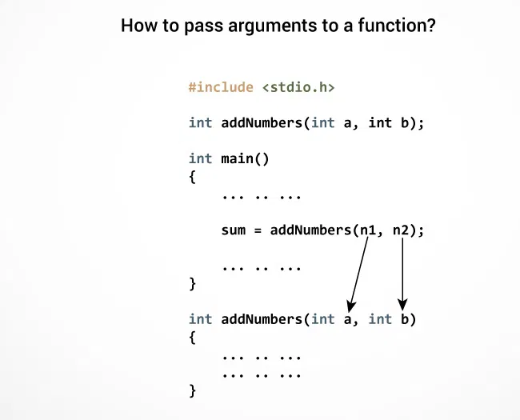
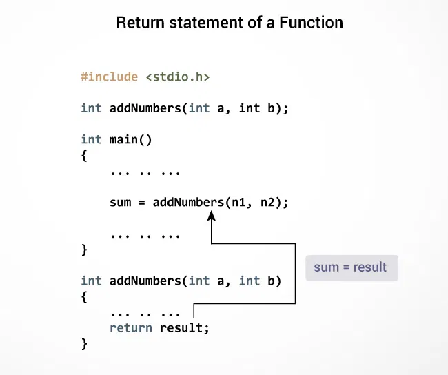

# 🤖 C Functions

A function is a block of code that performs a specific task.

Suppose, you need to create a program to create a circle and color it. You can create two functions to solve this problem:

- create a circle function
- create a color function

Dividing a complex problem into smaller chunks makes our program easy to understand and reuse.

### 📌 Types of function

There are two types of function in C programming:

- Standard library functions 
- User-defined functions

## 📌 Standard library functions

Standard library functions or simply C Library functions are inbuilt functions in C programming.

The prototype and data definitions of these functions are present in their respective header files. To use these functions we need to include the header file in our program. For example,

- The `printf()` is a standard library function to send formatted output to the screen (display output on the screen). This function is defined in the `stdio.h` header file.
  Hence, to use the `printf()`function, we need to include the `stdio.h` header file using `#include <stdio.h>`.
- The `sqrt()` function calculates the square root of a number. The function is defined in the `math.h` header file.  
```c++
#include <stdio.h>
int main()
{
   printf("Catch me if you can."); 
}
```
If you try to use `printf()` without including the `stdio.h` header file, you will get an error.

>[🔗 Example: Square root using sqrt() function](https://github.com/SonaniAkshit/Data-Structures-Algorithms-in-C/blob/main/Basic%20C/C%20Flow%20Control/C%20if...else%20Statement/if%20else%20statement.c)

### 📌 Library Functions in Different Header Files

| C Header Files | 	Description |
|----------------|--------------|
|  <assert.h>    | Program assertion functions|
|<ctype.h>	|Character type functions|
|<locale.h>	|Localization functions|
|<math.h>	|Mathematics functions|
|<setjmp.h>	|Jump functions|
|<signal.h>	|Signal handling functions|
|<stdarg.h>	|Variable arguments handling functions|
|<stdio.h>	|Standard Input/Output functions|
|<stdlib.h>	|Standard Utility functions|
|<string.h>	|String handling functions|
|<time.h>	|Date time functions|

## 📌 User-defined function

You can also create functions as per your need. Such functions created by the user are known as user-defined functions.

### 📌 How user-defined function works?
```c++
#include <stdio.h>
void functionName()
{
    ... .. ...
    ... .. ...
}

int main()
{
    ... .. ...
    ... .. ...

    functionName();
    
    ... .. ...
    ... .. ...
}
```
The execution of a C program begins from the `main()` function.

When the compiler encounters `functionName();`, control of the program jumps to

```c++
 void functionName()
```

And, the compiler starts executing the codes inside `functionName()`.

The control of the program jumps back to the `main()` function once code inside the function definition is executed.



> **Note,** function names are identifiers and should be unique.

A function is a block of code that performs a specific task.

C allows you to define functions according to your need. These functions are known as user-defined functions. For example:

Suppose, you need to create a circle and color it depending upon the radius and color. You can create two functions to solve this problem:

- `createCircle()` function
- `color()` function

Here is an example to add two integers. To perform this task, we have created an user-defined `addNumbers()`.
>[🔗 Example: User-defined function](https://github.com/SonaniAkshit/Data-Structures-Algorithms-in-C/blob/main/Basic%20C/C%20Flow%20Control/C%20if...else%20Statement/if%20else%20statement.c)

### 📌 Function prototype

A function prototype is simply the declaration of a function that specifies function's name, parameters and return type. It doesn't contain function body.

A function prototype gives information to the compiler that the function may later be used in the program.

**📌 Syntax:**
```c++
returnType functionName(type1 argument1, type2 argument2, ...);
```

In the above example, `int addNumbers(int a, int b);` is the function prototype which provides the following information to the compiler:

1) name of the function is `addNumbers()`
2) return type of the function is `int`
3) two arguments of type `int` are passed to the function

The function prototype is not needed if the user-defined function is defined before the `main()` function.

### 📌 Calling a function

Control of the program is transferred to the user-defined function by calling it.

**Syntax:**
```c++
functionName(argument1, argument2, ...);
```

In the above example, the function call is made using `addNumbers(n1, n2);` statement inside the `main()` function.

### 📌 Function definition

Function definition contains the block of code to perform a specific task. In our example, adding two numbers and returning it.

**Syntx:**
```c++
returnType functionName(type1 argument1, type2 argument2, ...)
{
    //body of the function
}
```
When a function is called, the control of the program is transferred to the function definition. And, the compiler starts executing the codes inside the body of a function.

### 📌 Passing arguments to a function

In programming, argument refers to the variable passed to the function. In the above example, two variables `n1` and `n2` are passed during the function call.

The parameters `a` and `b` accepts the passed arguments in the function definition. These arguments are called formal parameters of the function.



The type of arguments passed to a function and the formal parameters must match, otherwise, the compiler will throw an error.

If `n1` is of char type, `a` also should be of char type. If `n2` is of float type, variable `b` also should be of float type.

A function can also be called without passing an argument.

### 📌 Return Statement

The return statement terminates the execution of a function and returns a value to the calling function. The program control is transferred to the calling function after the return statement.

In the above example, the value of the `result` variable is returned to the main function. The `sum` variable in the `main()` function is assigned this value.



**Syntax:**
```c++
return (expression);
```
**For example,**
```c++
return a;
return (a+b);
```
The type of value returned from the function and the return type specified in the function prototype and function definition must match.

### 📌 Advantages of user-defined function

1) The program will be easier to understand, maintain and debug.
2) Reusable codes that can be used in other programs
3) A large program can be divided into smaller modules. Hence, a large project can be divided among many programmers.

### 📌 Types of User-defined Functions in C Programming

These 4 programs below check whether the integer entered by the user is a prime number or not.

The output of all these programs below is the same, and we have created a user-defined function in each example. However, the approach we have taken in each example is different.

**📌 Example 1:**
>[🔗 Example 1: No Argument Passed and No Return Value](https://github.com/SonaniAkshit/Data-Structures-Algorithms-in-C/blob/main/Basic%20C/C%20Flow%20Control/C%20if...else%20Statement/if%20else%20statement.c)

The `checkPrimeNumber()` function takes input from the user, checks whether it is a prime number or not, and displays it on the screen.

The empty parentheses in `checkPrimeNumber();` inside the `main()` function indicates that no argument is passed to the function.

The return type of the function is `void`. Hence, no value is returned from the function.

**📌 Example 2:**
>[🔗 Example 2: No Arguments Passed But Returns a Value](https://github.com/SonaniAkshit/Data-Structures-Algorithms-in-C/blob/main/Basic%20C/C%20Flow%20Control/C%20if...else%20Statement/if%20else%20statement.c)

The empty parentheses in the `n = getInteger();` statement indicates that no argument is passed to the function. And, the value returned from the function is assigned to `n`.

Here, the `getInteger()` function takes input from the user and returns it. The code to check whether a number is prime or not is inside the `main()` function.

**📌 Example 3:**
>[🔗 Example 3: Argument Passed But No Return Value](https://github.com/SonaniAkshit/Data-Structures-Algorithms-in-C/blob/main/Basic%20C/C%20Flow%20Control/C%20if...else%20Statement/if%20else%20statement.c)

The integer value entered by the user is passed to the `checkPrimeAndDisplay()` function.

Here, the `checkPrimeAndDisplay()` function checks whether the argument passed is a prime number or not and displays the appropriate message.

**📌 Example 4:**
>[🔗 Example 4: Argument Passed and Returns a Value](https://github.com/SonaniAkshit/Data-Structures-Algorithms-in-C/blob/main/Basic%20C/C%20Flow%20Control/C%20if...else%20Statement/if%20else%20statement.c)

The input from the user is passed to the `checkPrimeNumber()` function.

The `checkPrimeNumber()` function checks whether the passed argument is prime or not.

If the passed argument is a prime number, the function returns **0**. If the passed argument is a non-prime number, the function returns **1**. The return value is assigned to the `flag` variable.

Depending on whether `flag` is **0** or **1**, an appropriate message is printed from the `main()` function.

### 📌 Which approach is better? 

Well, it depends on the problem you are trying to solve. In this case, passing an argument and returning a value from the function (example 4) is better.

A function should perform a specific task. The `checkPrimeNumber()` function doesn't take input from the user nor it displays the appropriate message. It only checks whether a number is prime or not.