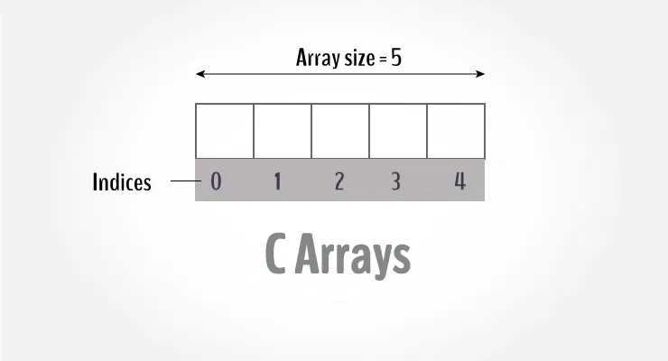
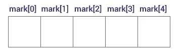
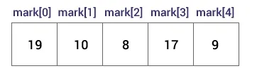
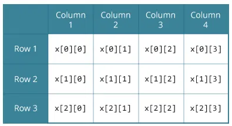

# 🅰️ Arrays

An array is a variable that can store multiple values. For example, if you want to store 100 integers, you can create an array for it.
```c++
int data[100];
```



### 📌  How to declare an array?
```c++
dataType arrayName[arraySize];
```
**For example,**
```c++
float mark[5];
```
Here, we declared an array, `mark`, of floating-point type. And its size is 5. Meaning, it can hold 5 floating-point values.

It's important to note that the size and type of an array cannot be changed once it is declared.

###  📌 Access Array Elements
You can access elements of an array by indices.

Suppose you declared an array `mark` as above. The first element is `mark[0]`, the second element is `mark[1]` and so on.


**Few keynotes:**

- Arrays have 0 as the first index, not 1. In this example, `mark[0]` is the first element.
- If the size of an array is `n`, to access the last element, the `n-1` index is used. In this example, `mark[4]`
- Suppose the starting address of `mark[0]` is **2120d**. Then, the address of the `mark[1]` will be **2124d**. Similarly, the address of `mark[2]` will be **2128d** and so on.
  This is because the size of a `float` is 4 bytes.

### 📌 How to initialize an array?
It is possible to initialize an array during declaration. For example,
```c++
int mark[5] = {19, 10, 8, 17, 9};
```
You can also initialize an array like this.
```c++
int mark[] = {19, 10, 8, 17, 9};
```
Here, we haven't specified the size. However, the compiler knows its size is 5 as we are initializing it with 5 elements.


Here,
```c++
mark[0] is equal to 19
mark[1] is equal to 10
mark[2] is equal to 8
mark[3] is equal to 17
mark[4] is equal to 9
```

### 📌 Change Value of Array elements
```c++
int mark[5] = {19, 10, 8, 17, 9}

// make the value of the third element to -1
mark[2] = -1;

// make the value of the fifth element to 0
mark[4] = 0;
```

###  📌 Input and Output Array Elements
Here's how you can take input from the user and store it in an array element.
```c++
// take input and store it in the 3rd element
scanf("%d", &mark[2]);

// take input and store it in the ith element
scanf("%d", &mark[i-1]);
```
Here's how you can print an individual element of an array.
```c++
// print the first element
printf("%d", mark[0]);

// print the third element
printf("%d", mark[2]);

// print the ith element
printf("%d", mark[i-1]);
```
>[🔗 Example 1: Array Input/Output](https://github.com/SonaniAkshit/Data-Structures-Algorithms-in-C/blob/main/Basic%20C/C%20Functions/Ex%20Square%20root%20using%20function.c)

>[🔗 Example 2: Calculate Average](https://github.com/SonaniAkshit/Data-Structures-Algorithms-in-C/blob/main/Basic%20C/C%20Functions/Ex%20Square%20root%20using%20function.c)

### 📌 Access elements out of its bound!
Suppose you declared an array of 10 elements. Let's say,
```c++
int testArray[10];
```
You can access the array elements from `testArray[0]` to `testArray[9]`.

Now let's say if you try to access `testArray[12]`. The element is not available. This may cause unexpected output (undefined behavior). Sometimes, you might get an error, and some other times your program may run correctly.

Hence, you should never access elements of an array outside of its bound.

## 🔳 Multidimensional Arrays

In C programming, you can create an array of arrays. These arrays are known as multidimensional arrays. For example,

```c++
float x[3][4];
```
Here, `x` is a two-dimensional (2d) array. The array can hold 12 elements. You can think the array as a table with 3 rows and each row has 4 columns.


Similarly, you can declare a three-dimensional (3d) array. For example,
```c++
float y[2][4][3];
```
Here, the array `y` can hold 24 elements.

### 📌 Initializing a multidimensional array

Here is how you can initialize two-dimensional and three-dimensional arrays:

### 📌 Initialization of a 2d array
```c++
// Different ways to initialize two-dimensional array

int c[2][3] = {{1, 3, 0}, {-1, 5, 9}};
         
int c[][3] = {{1, 3, 0}, {-1, 5, 9}};
                
int c[2][3] = {1, 3, 0, -1, 5, 9};
```
### 📌 Initialization of a 3d array
You can initialize a three-dimensional array in a similar way to a two-dimensional array. Here's an example,
```c++
int test[2][3][4] = {
    {{3, 4, 2, 3}, {0, -3, 9, 11}, {23, 12, 23, 2}},
    {{13, 4, 56, 3}, {5, 9, 3, 5}, {3, 1, 4, 9}}};
```

>[🔗 Example 1: Two-dimensional array to store and print values](https://github.com/SonaniAkshit/Data-Structures-Algorithms-in-C/blob/main/Basic%20C/C%20Functions/Ex%20Square%20root%20using%20function.c)

>[🔗 Example 2: Sum of two matrices](https://github.com/SonaniAkshit/Data-Structures-Algorithms-in-C/blob/main/Basic%20C/C%20Functions/Ex%20Square%20root%20using%20function.c)

>[🔗 Example 3: Three-dimensional array](https://github.com/SonaniAkshit/Data-Structures-Algorithms-in-C/blob/main/Basic%20C/C%20Functions/Ex%20Square%20root%20using%20function.c)


## 🔧 Pass arrays to a function 
In C programming, you can pass an entire array to functions. Before we learn that, let's see how you can pass individual elements of an array to functions.

### 📌 Pass Individual Array Elements
>[🔗 Example 1: Pass Individual Array Elements](https://github.com/SonaniAkshit/Data-Structures-Algorithms-in-C/blob/main/Basic%20C/C%20Functions/Ex%20Square%20root%20using%20function.c)

Here, we have passed array parameters to the `display()` function in the same way we pass variables to a function.
```c++
// pass second and third elements to display()
display(ageArray[1], ageArray[2]);
```
We can see this in the function definition, where the function parameters are individual variables:
```c++
void display(int age1, int age2) {
  // code
}
```
>[🔗 Example 2: Pass Arrays to Functions](https://github.com/SonaniAkshit/Data-Structures-Algorithms-in-C/blob/main/Basic%20C/C%20Functions/Ex%20Square%20root%20using%20function.c)

To pass an entire array to a function, only the name of the array is passed as an argument.

```c++
result = calculateSum(num);
```
However, notice the use of `[]` in the function definition.
```c++
float calculateSum(float num[]) {
... ..
}
```
This informs the compiler that you are passing a one-dimensional array to the function.

### 📌 Pass Multidimensional Arrays to a Function

To pass multidimensional arrays to a function, only the name of the array is passed to the function (similar to one-dimensional arrays).

>[🔗 Example 3: Pass two-dimensional arrays](https://github.com/SonaniAkshit/Data-Structures-Algorithms-in-C/blob/main/Basic%20C/C%20Functions/Ex%20Square%20root%20using%20function.c)

Notice the parameter `int num[2][2]` in the function prototype and function definition:
```c++
// function prototype
void displayNumbers(int num[2][2]);
```
This signifies that the function takes a two-dimensional array as an argument. We can also pass arrays with more than 2 dimensions as a function argument.

When passing two-dimensional arrays, it is not mandatory to specify the number of rows in the array. However, the number of columns should always be specified.

For example,
```c++
void displayNumbers(int num[][2]) {
  // code
}
```

<div align="center">

# End of Arrays in C

</div>

### 🤝Clone & Setup
```bash
git clone https://github.com/SonaniAkshit/Data-Structures-Algorithms-in-C.git
cd Data-Structures-Algorithms-in-C
```

## 🙌 Contributing
- Pull requests and feedback are welcome! Whether it's fixing bugs, improving UI, or adding features — your help is appreciated.

## 📧 Contact
- **Developer:** Akshit Sonani
- **Email:** sonaniakshit684@gmail.com
- **GitHub:** [SonaniAkshit](https://github.com/SonaniAkshit)

# 🔥 Happy Coding! 🚀
### ⭐ Star this repository if you find it helpful!