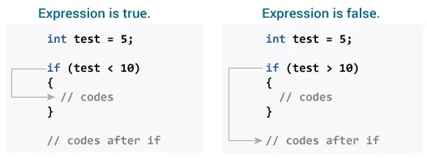
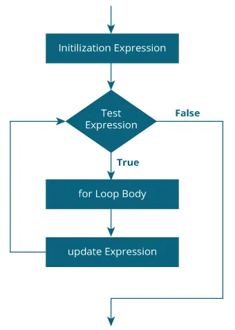

# 🧑🏻‍💻Getting Started with ©️ C Programming
- ***C is a powerful general-purpose programming language known for its efficiency and flexibility***.

# 🔁C Flow Control

## 🧠 1) `if...else` Statements in C

### ✅ Simple `if` Statement
📌 **Syntax:**
```c++
if (test expression) 
{
   // code
}
```
>[🔗 Example: `if` Statement](https://github.com/SonaniAkshit/Data-Structures-Algorithms-in-C/blob/main/Basic%20C/C%20Flow%20Control/C%20if%20else%20Statement/if%20statement.c)

### 📌 How if statement works?
- The if statement evaluates the test expression inside the parenthesis ().
  - If the test expression is evaluated to true, statements inside the body of `if` are executed.
  - If the test expression is evaluated to false, statements inside the body of `if` are not executed.

### 📝 Working of if Statement



### ⚖️ `if...else` Statement
The `if` statement may have an optional `else` block.

📌 **Syntax:**
```c++
if (test expression) {
    // run code if test expression is true
}
else {
    // run code if test expression is false
}
```
>[🔗 Example: `if...else` Statement](https://github.com/SonaniAkshit/Data-Structures-Algorithms-in-C/blob/main/Basic%20C/C%20Flow%20Control/C%20if%20else%20Statement/if%20else%20statement.c)

### 📌 How if...else statement works?
- If the test expression is evaluated to true,
  - statements inside the body of `if` are executed.
  - statements inside the body of `else` are skipped from execution.
- If the test expression is evaluated to false,
  - statements inside the body of `else` are executed
  - statements inside the body of if are skipped from execution.

### 📝 Working of if...else Statement


### 🪜 `if...else if` Ladder
The `if...else` statement executes two different codes depending upon whether the test expression is true or false. Sometimes, a choice has to be made from more than 2 possibilities.*

The **if...else ladder** allows you to check between multiple test expressions and execute different statements.*

📌 **Syntax:**
```c++
if (test expression1) {
   // statement(s)
}
else if(test expression2) {
   // statement(s)
}
else if (test expression3) {
   // statement(s)
}
.
.
else {
   // statement(s)
}
```
>[🔗 Example: `if...else if` Ladder](https://github.com/SonaniAkshit/Data-Structures-Algorithms-in-C/blob/main/Basic%20C/C%20Flow%20Control/C%20if%20else%20Statement/if%20else%20Ladder.c)

### 🧩 Nested if...else
It is possible to include an `if...else` statement inside the body of another `if...else` statement.*

**Example:**

This program given below relates two integers using either `<`,` >` and `=` similar to the `if...else` ladder's example. However, we will use a nested `if...else` statement to solve this problem.
>[🔗 Example: Nested `if...else`](https://github.com/SonaniAkshit/Data-Structures-Algorithms-in-C/blob/main/Basic%20C/C%20Flow%20Control/C%20if%20else%20Statement/Nested%20if%20else.c)

- **If the body of an `if...else` statement has only one statement, you do not need to use brackets `{}`.**

For example, this code
```c++
if (a > b) {
    printf("Hello");
}
printf("Hi");
```
- *is equivalent to*
```c++
if (a > b)
    printf("Hello");
printf("Hi");
```
---
## 🧠 2) Loops in C
In programming, a loop is used to repeat a block of code until the specified condition is met.

C programming has three types of loops:
1) `for` loop ✅
2) `while` loop ⏳
3) `do...while` loop 🔁

## 🧮 `for` Loop

📌 **Syntax**:
```c++
for (initializationStatement; testExpression; updateStatement)
{
    // statements inside the body of loop
}
```
### 📌 How it works:

1) The initialization runs once.

2) The test condition is checked:
    - If true: execute the loop body.
    - If false: exit the loop.

3) After each iteration, the update statement runs.

4) Repeat until the test condition becomes false.
### 🖼️ Flowchart of `for` loop:


>[🔗 Example1: `for` Loop](https://github.com/SonaniAkshit/Data-Structures-Algorithms-in-C/blob/main/Basic%20C/C%20Flow%20Control/Loops/Ex1%20for%20loop.c)

>[🔗 Example2: `for` Loop](https://github.com/SonaniAkshit/Data-Structures-Algorithms-in-C/blob/main/Basic%20C/C%20Flow%20Control/Loops/Ex2%20for%20loop.c)


### 🤝Clone & Setup
```bash
git clone https://github.com/SonaniAkshit/Data-Structures-Algorithms-in-C.git
cd Data-Structures-Algorithms-in-C
```

## 🙌 Contributing
- Pull requests and feedback are welcome! Whether it's fixing bugs, improving UI, or adding features — your help is appreciated.

## 📧 Contact
- **Developer:** Akshit Sonani
- **Email:** sonaniakshit684.com
- **GitHub:** [SonaniAkshit](https://github.com/SonaniAkshit)

# 🔥 Happy Coding! 🚀
### ⭐ Star this repository if you find it helpful!