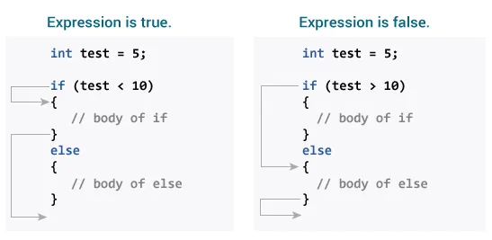

# 🧑🏻‍💻Getting Started with ©️
- ***C is a powerful general-purpose programming language known for its efficiency and flexibility***.

# C Flow Control

## 1) C if...else Statement

### C if Statement:
- *The syntax of the if statement in C programming is:*
```c++
if (test expression) 
{
   // code
}
```
- *example*
>[Working of if Statement](https://github.com/SonaniAkshit/Data-Structures-Algorithms-in-C/blob/main/Basic%20C/C%20Flow%20Control/C%20if%20else%20Statement/if%20statement.c)

### How if statement works?
- The if statement evaluates the test expression inside the parenthesis ().
  - If the test expression is evaluated to true, statements inside the body of `if` are executed.
  - If the test expression is evaluated to false, statements inside the body of `if` are not executed.

### Working of if Statement


### C if...else Statement
- *The `if` statement may have an optional `else` block. The syntax of the `if..else` statement is:*
```c++
if (test expression) {
    // run code if test expression is true
}
else {
    // run code if test expression is false
}
```
- *example*
>[Working of if...else Statement](https://github.com/SonaniAkshit/Data-Structures-Algorithms-in-C/blob/main/Basic%20C/C%20Flow%20Control/C%20if%20else%20Statement/if%20else%20statement.c)

### How if...else statement works?
- If the test expression is evaluated to true,
  - statements inside the body of `if` are executed.
  - statements inside the body of `else` are skipped from execution.
- If the test expression is evaluated to false,
  - statements inside the body of `else` are executed
  - statements inside the body of if are skipped from execution.

### Working of if...else Statement


### C if...else Ladder
- *The `if...else` statement executes two different codes depending upon whether the test expression is true or false. Sometimes, a choice has to be made from more than 2 possibilities.*
- *The **if...else ladder** allows you to check between multiple test expressions and execute different statements.*
- *Syntax of `if...else` Ladder*
```c++
if (test expression1) {
   // statement(s)
}
else if(test expression2) {
   // statement(s)
}
else if (test expression3) {
   // statement(s)
}
.
.
else {
   // statement(s)
}
```
- *example*
>[Working of if...else Ladder](https://github.com/SonaniAkshit/Data-Structures-Algorithms-in-C/blob/main/Basic%20C/C%20Flow%20Control/C%20if%20else%20Statement/if%20else%20Ladder.c)

### Nested if...else
- *It is possible to include an `if...else` statement inside the body of another `if...else` statement.*

- ***Example***
  - This program given below relates two integers using either `<`,` >` and `=` similar to the `if...else` ladder's example. However, we will use a nested `if...else` statement to solve this problem.
>[Working of Nested if...else](https://github.com/SonaniAkshit/Data-Structures-Algorithms-in-C/blob/main/Basic%20C/C%20Flow%20Control/C%20if%20else%20Statement/Nested%20if%20else.c)

- ***If the body of an `if...else` statement has only one statement, you do not need to use brackets `{}`.***
- *For example, this code*
```c++
if (a > b) {
    printf("Hello");
}
printf("Hi");
```
- *is equivalent to*
```c++
if (a > b)
    printf("Hello");
printf("Hi");
```
---
## 2)Loops
- In programming, a loop is used to repeat a block of code until the specified condition is met.
- C programming has three types of loops:
> 1) for loop
> 2) while loop
> 3) do...while loop
- We will learn about `for` loop in this tutorial. In the next tutorial, we will learn about `while` and `do...while` loop.

### for Loop

- *The syntax of the for loop is:*
```c++
for (initializationStatement; testExpression; updateStatement)
{
    // statements inside the body of loop
}
```
### How for loop works?

- The initialization statement is executed only once.
- Then, the test expression is evaluated. If the test expression is evaluated to false, the for loop is terminated.
- However, if the test expression is evaluated to true, statements inside the body of the for loop are executed, and the update expression is updated. 
- Again the test expression is evaluated.
- This process goes on until the test expression is false. When the test expression is false, the loop terminates.

### for loop Flowchart: Working of for loop


- *example*
>[Working of for loop](https://github.com/SonaniAkshit/Data-Structures-Algorithms-in-C/blob/main/Basic%20C/C%20Flow%20Control/C%20if%20else%20Statement/if%20else%20Ladder.c)
